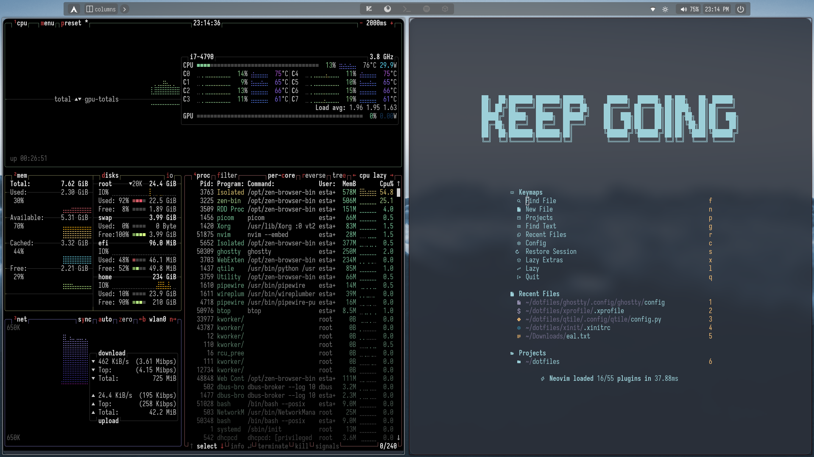

# Alvarof260's Dotfiles



This repository contains my personal configuration files (dotfiles) for various applications I use in my daily development workflow on Linux. The setup is centered around the Qtile window manager, Neovim, and a suite of terminal tools, all themed for a consistent and productive experience.

## Configured Software

- **Window Manager**: [Qtile](https://qtile.org/)
- **Compositor**: [Picom](https://github.com/yshui/picom)
- **Shell**: [Bash](https://www.gnu.org/software/bash/)
- **Terminal Emulators**: [Alacritty](https://alacritty.org/) & [Ghostty](https://github.com/ghostty-org/ghostty)
- **Terminal Multiplexer**: [Zellij](https://zellij.dev/)
- **Code Editor**: [Neovim](https://neovim.io/) (LazyVim based)
- **Shell Prompt**: [Starship](https://starship.rs/)
- **Application Launcher**: [Rofi](https://github.com/davatorium/rofi)
- **System Utilities**: `.xinitrc`, `.xprofile`, [Redshift](http://jonls.dk/redshift/)

## Key Features

### Desktop Environment (Qtile)

The desktop experience is managed by Qtile, providing a minimal and keyboard-driven interface.

- **Modular Configuration**: The Qtile setup is broken down into logical modules for `keys`, `groups`, `layouts`, `screens`, and `widgets`.
- **Dynamic Theming**: The look and feel are managed by a simple JSON-based theme system located in `qtile/.config/qtile/themes/`. The active theme is set in `qtile/config.json`. Current themes include `obsidian` (default), `kanagawa-dragon`, `sakura`, and `monochrome`.
- **Custom Bar**: A modern and clean status bar built using `qtile-extras` widgets, featuring rounded decorations, system stats (CPU, Memory, Temp), and more.
- **Visuals**: Picom is configured for smooth fading animations, window shadows, rounded corners, and `dual_kawase` background blur for a refined aesthetic.
- **Application Launcher**: Rofi is themed with a Rosé Pine look for consistency.

### Terminal & Shell

The terminal is the heart of the workflow, with several tools working together.

- **Terminals**: Configurations for both Alacritty and Ghostty are provided, featuring transparent backgrounds and the `IosevkaTerm` font.
- **Prompt**: Starship provides a powerful and visually appealing prompt, heavily customized with a Rosé Pine palette to show Git status, programming language versions, and more.
- **Multiplexer**: Zellij is configured with a custom keymap, a Rosé Pine theme, and a `work` layout that includes a customized status bar provided by the `zjstatus` plugin. A handy `zellij_forgot` plugin is included to act as a keybinding cheat-sheet.

### Neovim (LazyVim)

The Neovim configuration is a personalized version of the LazyVim starter, tailored for frontend development.

- **Base**: Built on [LazyVim](https://www.lazyvim.org/) for a modern, fast, and extensible setup.
- **Theme**: The `rose-pine` colorscheme is the default, with `transparent.nvim` enabled for a seamless look with the terminal compositor.
- **Personalized AI**: The `CopilotChat.nvim` configuration includes a unique and extensive system prompt that persona-fies the assistant as "The Gentleman," an expert frontend architect specializing in Angular and React. This provides highly tailored and context-aware responses.
- **Key Plugins**:
  - **UI**: `lualine.nvim`, `Noice`, `zen-mode.nvim`, `twilight.nvim`, and `snacks.nvim` for a custom dashboard.
  - **File Navigation**: `oil.nvim` is used for file system browsing, mapped to `-`.
  - **Utility**: `kulala.nvim` for making HTTP requests directly within Neovim.
  - **Practice**: Includes `vim-be-good` to practice Vim motions.

## Installation

**Disclaimer**: These are my personal dotfiles. You should fork this repository and adapt the configurations to your own needs. Do not run any scripts without understanding what they do.

1. **Clone the repository**:

   ```bash
   git clone https://github.com/alvarof260/dotfiles.git ~/dotfiles
   ```

2. **Back up your existing dotfiles**:
   Before creating symlinks, make sure to back up any existing configuration files you wish to keep.

3. **Create symbolic links**:
   Link the configuration files and directories from this repository to their respective locations in `~/.config` and your home directory.

   Example for Qtile:

   ```bash
   mkdir -p ~/.config
   ln -s ~/dotfiles/qtile/.config/qtile ~/.config/qtile
   ```

   Repeat this process for all the desired configurations (`alacritty`, `nvim`, `zellij`, etc.).

### Helper Script

The `.bashrc` file includes a small helper function, `dotfiles_add`, to simplify the process of adding a new configuration file to the repository.

**Usage**:

```bash
dotfiles_add /path/to/your/config/file
```

This command will:

1. Move the specified file into the corresponding path within the `~/dotfiles` directory.
2. Create a symbolic link from the original location to the new location in the dotfiles repository.

## Main Keybindings (Qtile)

The primary modifier key is `Mod` (Super/Windows key).

| Keybinding              | Action                                |
| ----------------------- | ------------------------------------- |
| `Mod + Return`          | Launch terminal (`ghostty`)           |
| `Mod + b`               | Launch browser (`zen-browser` script) |
| `Mod + v`               | Launch Neovim in a new terminal       |
| `Mod + r`               | Launch Rofi application runner        |
| `Mod + w`               | Close focused window                  |
| `Mod + h/j/k/l`         | Move focus between windows            |
| `Mod + Shift + h/j/k/l` | Move focused window                   |
| `Mod + Tab`             | Cycle through available layouts       |
| `Mod + [1-5]`           | Switch to workspace 1-5               |
| `Mod + Control + r`     | Reload Qtile configuration            |
| `Mod + Control + q`     | Shutdown Qtile                        |
| `F2` / `F3`             | Decrease / Increase volume            |
| `F4`                    | Mute / Unmute volume                  |
